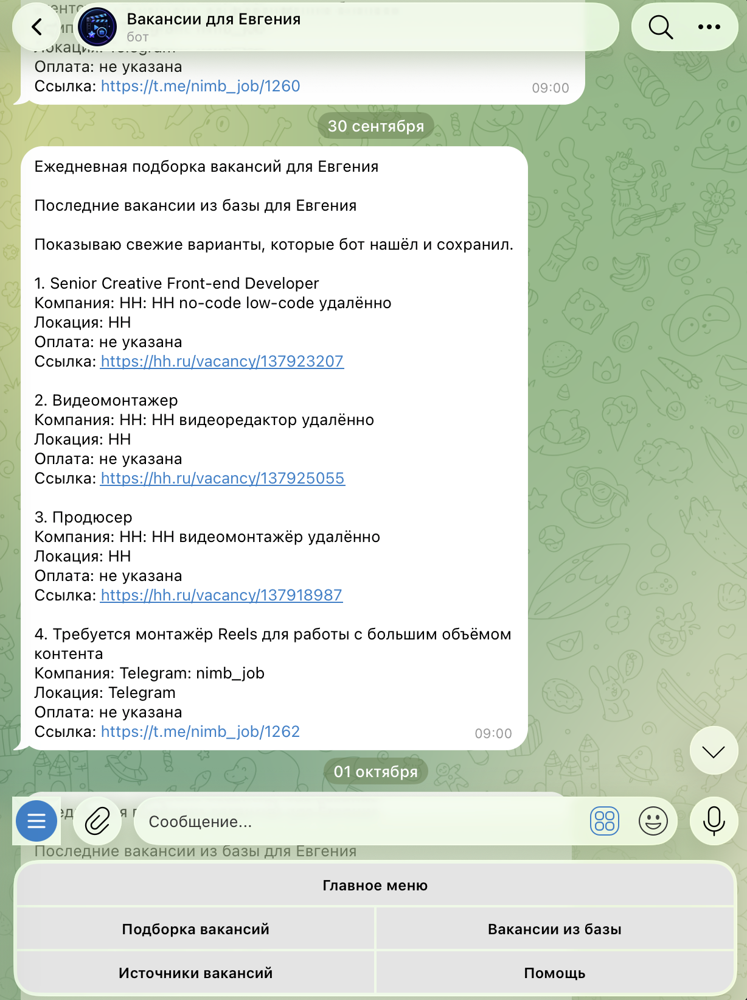
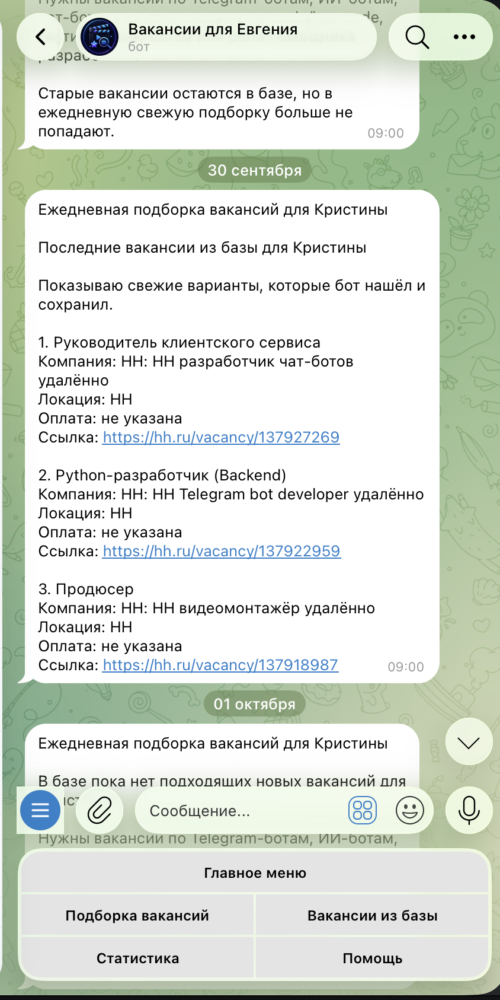
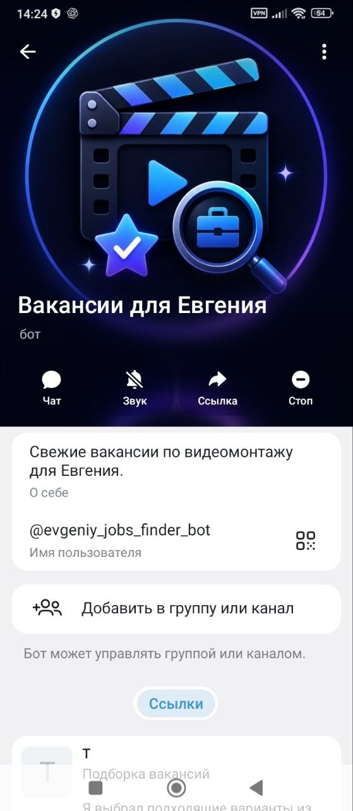

Telegram-бот для поиска, хранения и отбора вакансий с раздельными сценариями для Евгения и Кристины.

Бот подбирает вакансии по разным профилям: для Евгения — по видеомонтажу, постпродакшну, цветокоррекции, YouTube, Reels, Shorts, VFX и смежным направлениям; для Кристины — по AI-assisted разработке, Telegram-ботам, автоматизации, API, базам данных и техническим задачам.

## Задача проекта

Проект создан для автоматизации поиска подходящих вакансий. Вместо ручного просмотра разных источников бот собирает вакансии, сохраняет их в базе, показывает свежие варианты и помогает сделать подборку по заданному профилю.

## Что умеет бот

- Показывает главное меню пользователя
- Выводит свежие вакансии
- Показывает вакансии из базы
- Делает подборку подходящих вакансий
- Использует AI-анализ для отбора
- Поддерживает административные команды
- Позволяет добавлять и удалять вакансии
- Использует базу данных для хранения информации
- Работает через webhook и cron-задачи

## Режимы работы

### Раздельные подборки вакансий

В боте реализованы разные сценарии выдачи вакансий для двух пользователей:

- Евгений получает вакансии по своему профессиональному профилю;
- Кристина как администратор получает отдельную подборку вакансий по своему профилю.

Подборки не смешиваются и формируются по разным критериям.

## Скриншоты

### Раздельные подборки вакансий

<table>
  <tr>
    <td align="center"><b>Вакансии для Евгения</b></td>
    <td align="center"><b>Вакансии для Кристины</b></td>
  </tr>
  <tr>
    <td align="center"></td>
    <td align="center"></td>
  </tr>
</table>

### Профиль бота

### Пользовательский режим

Пользователь может открыть меню, посмотреть свежие вакансии, получить подборку и перейти по ссылкам на подходящие предложения.

### Административный режим

Администратор может проверять статус бота, добавлять вакансии, удалять неподходящие варианты, тестировать базу данных и работу AI-подбора.

## Использованные технологии

- Telegram Bot API
- Cloudflare Workers
- Cloudflare D1
- OpenRouter
- JavaScript / TypeScript
- SQL
- JSON
- Webhook
- Cron-задачи
- Git / GitHub

## Примеры команд

- `/start` — запуск бота
- `/menu` — главное меню
- `/today` — подборка вакансий
- `/vacancies` — вакансии из базы
- `/status` — проверка статуса
- `/add_vacancy` — добавление вакансии
- `/delete_vacancy` — удаление вакансии
- `/ai_test` — тест AI
- `/db_test` — тест базы данных

## Моя роль в проекте

Я собирала и развивала логику Telegram-бота с использованием ChatGPT / Codex как инструментов разработки.

В рамках проекта я:
- продумывала пользовательские и административные сценарии;
- настраивала структуру команд и логику взаимодействия;
- работала со структурой базы данных;
- подключала AI-модель и связанные сценарии;
- тестировала функции и проверяла поведение бота;
- дорабатывала логику по результатам реального использования;
- развивала раздельные сценарии под вакансии Евгения и Кристины.
## Статус проекта

Проект работает как Telegram-бот и используется для ежедневного поиска и отбора вакансий.

Демо-бот: https://t.me/evgeniy_jobs_finder_bot
